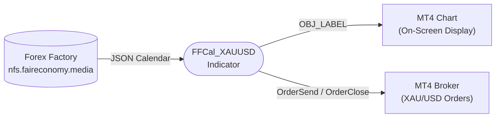
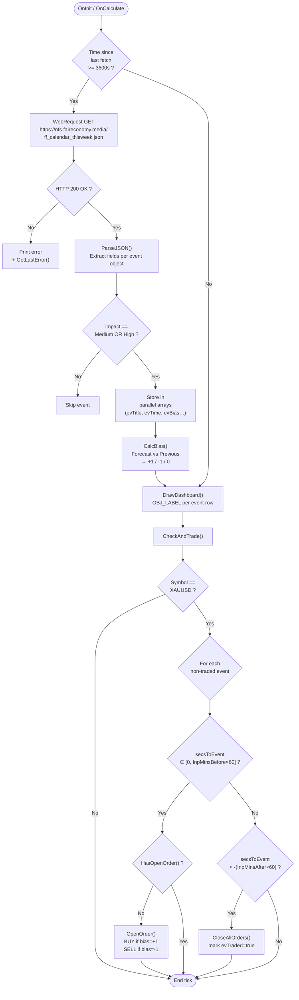
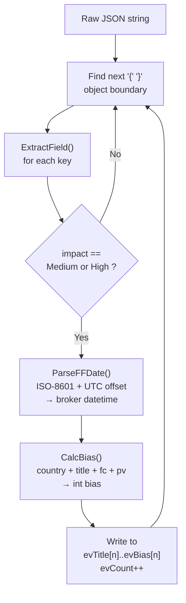
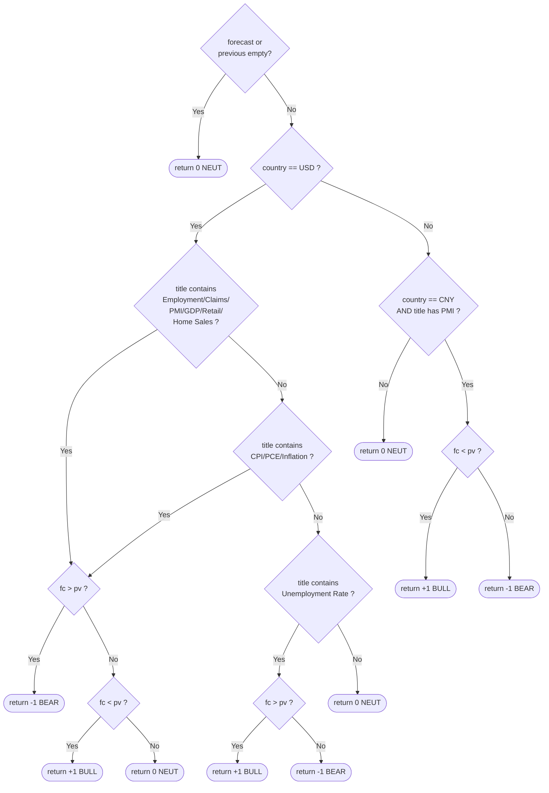

# Data Flow Diagram — FFCal_XAUUSD

## Overview

This document describes the end-to-end data flow of the `FFCal_XAUUSD.mq4` indicator from calendar fetch to order execution.

---

## Level 0 — Context Diagram



---

## Level 1 — Main Process Flow



---

## Level 2 — ParseJSON Detail



---

## Level 2 — CalcBias Decision Tree



---

## Timing Diagram

```
Time axis →

T-60min   FF JSON updated by server (hourly)
T-5min    CheckAndTrade: OpenOrder() fires (InpMinsBefore=5)
T=0       News event releases
T+15min   CheckAndTrade: CloseAllOrders() fires if order still open (InpMinsAfter=15)
```

---

## Data Store

```
In-memory parallel arrays (evCount max 60)
──────────────────────────────────────────
evTitle[]     string   Event name
evCountry[]   string   Country code
evTime[]      datetime Broker-local event time
evImpact[]    string   "Medium" | "High"
evForecast[]  string   Raw forecast string
evPrevious[]  string   Raw previous string
evBias[]      int      +1 | -1 | 0
evTraded[]    bool     Order already placed?
```
